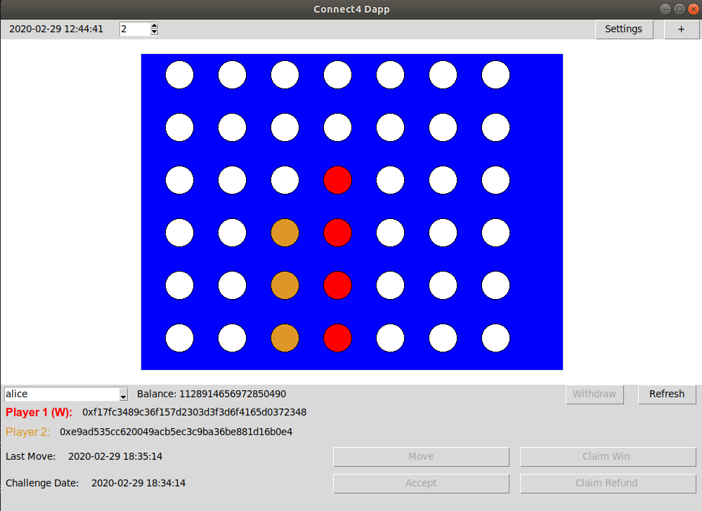

# connect4-dapp
A connect4 dapp built with tkinter and web3. Currently supported on Rinkeby Ethereum testnet.

Dependencies
1) Python 3.6 or higher 

Setup Dapp
1) git clone https://github.com/realjohnward/connect4-dapp.git && cd connect4-dapp
2) pip install web3
3) cd dapp && python main.py
4) Login or signup for Infura, create a new project, copy the project's rinkeby endpoint and paste it into 
  the "Url" box in the dapp's settings menu.
5) Setup Rinkeby accounts (https://gist.github.com/cryptogoth/10a98e8078cfd69f7ca892ddbdcf26bc) so you can add
  accounts to the dapp.

